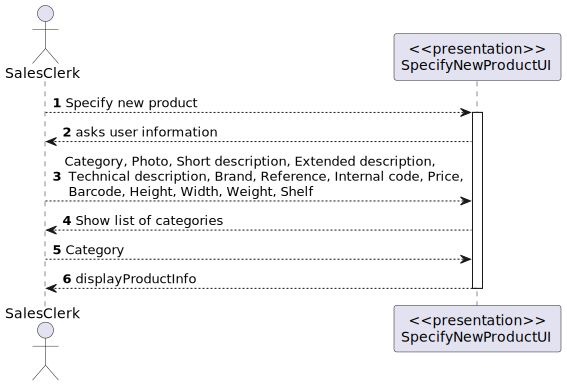
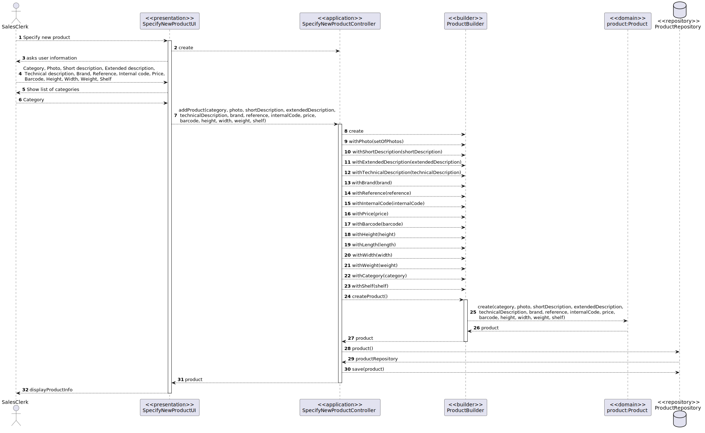
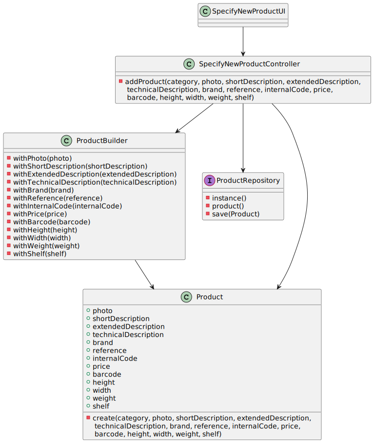

US1001
=======================================

# 1. Requisitos

Como um Sales Clerk:
* Eu quero especificar um novo produto para venda

A interpretação feita deste requisito foi no sentido de criar um objeto Product, e indicar, para além das suas características, a categoria a que pertence e a sua localização na warehouse.
Esta funcionalidade tem dependência da US 1005 (Criar uma categoria) e da US 2001 (Criar uma warehouse).

# 2. Análise

##Campos únicos

Além do internal code, optamos por considerar os atributos production code, barcode e reference como únicos, pois num exemplo real, não é possível um produto estar associado, por exemplo, ao mesmo código de barras que outro produto diferente.

##Localização do produto

Aquando da introdução da localização do produto na warehouse, é feita uma verificação relativamente à ocupação dessa mesma localização, pois consideramos que, por shelf, é apenas encontrado um produto.

# 3. Design

## 3.1. Realização da Funcionalidade

###Diagrama SSD

###Diagrama SD

## 3.2. Diagrama de Classes

## 3.3. Padrões Aplicados

- Controller
- Builder
- Repository
- Factory