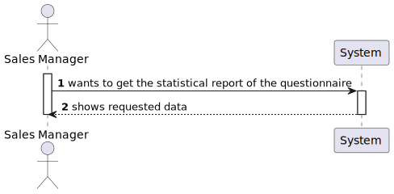
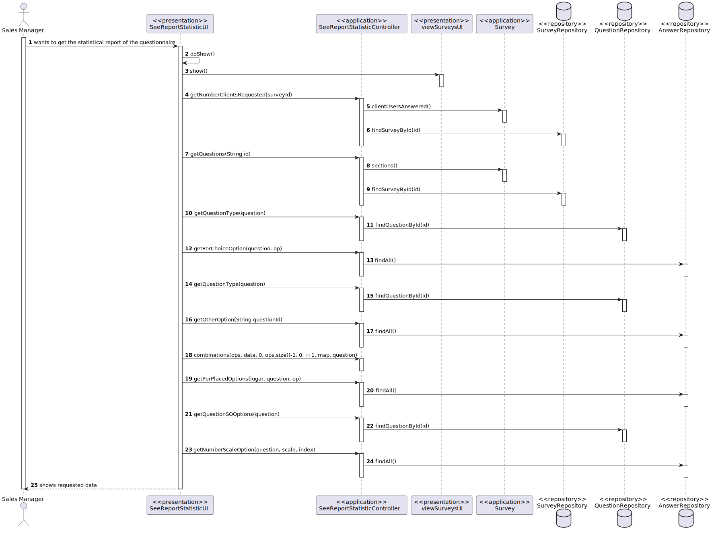
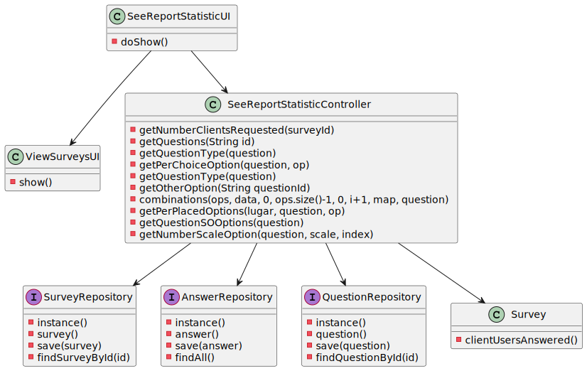

US3002
=======================================

# 1. Requisitos

Como um Sales Clerk:
* Eu quero ter acesso à lista de orders que foram despachadas para entrega ao cliente e ser capaz de atualizar as orders como entregues.

> **Question**: For this US, does the statistical report need to be shown to the SalesClerk or needs to be saved in some file too (p.e. text file)?
>
> **Answer**: The important is to show the statistical report. Saving the report is not seen as relevant since, at any time, the user might request to see the report again. Notice that the information on which the report is computed is already persisted on the system.

# 2. Análise

Nesta US, é requisitado um relatório estatístico sobre um dado questionário e as suas questões.

Baseado numa questão do cliente, os dados estatísticos que devem aparecer são:
* Número de utilizadores em que o questionário foi entregue, número de respostas obtidas e percentagem de respostas obtidas. (Questionário em si)
  Para realizar facilitar os cálculos, cada questionário é composto por duas listas (clientes por responder e respondidos), sendo que uma lista contém os clientes que ainda não responderam ao questionário e a outra contém os clientes que já responderam. Assim, basta comparar o tamanho destas duas listas para saber os dados estatísticos referidos acima.

* Distribuição (em percentagem) das respostas para cada opção (Questões de escolha única, com ou sem input)
  Neste caso, percorremos todas as instâncias de respostas presentes na base de dados e verificamos quantas vezes uma determinada questão foi selecionada. Além disso, é adicionada uma nova opção "Others" que representa as respostas em que o utilizador escreveu a sua resposta (input, não escolheu nenhuma das pre-definidas).

* Distribuição (em percentagem) das respostas para cada opção (ou combinação de opções) (Questões de escolha múltipla, com ou sem input)
  Neste caso, percorremos todas as instâncias de respostas presentes na base de dados associadas à questão referente e verificamos quantas vezes uma determinada questão foi selecionada. Além disso, é adicionada uma nova opção "Others" que representa as respostas em que o utilizador escreveu a sua resposta (input, não escolheu nenhuma das pre-definidas).
  Outro assunto são as respostas combinadas, em que se criou um método (combinations()) que retorna, para todas as combinações de opções possíveis, o número de vezes que cada combinação é respondida para uma determinada resposta.

* Distribuição (em percentagem) das variadas hipóteses para cada questão (Questões de ordenação)
  Para estas questões, como as respostas são introduzidas sequencialmente na lista de respostas de cada instância de answer, analisamos cada lista de respostas de cada answer à determinada questão e verificamos assim, para cada lugar, quantas vezes foi selecionada cada opção.

* Distribuião de cada opção por níveis de escala (Questões de escala)
  Nestas questões, verificamos para cada pergunta qual o nível de escala associado e retornamos o número de escolhas por nível para cada pergunta. Esta distrubuição difere das outras referidas anteriormente porque o resultado obito é a frequência absoluta de cada nível para cada pergunta.

Por fim, achámos, por bem, para o tipo de questões que faltam (Texto livre e numérico), apresentar a percentagem de respostas obtidas para cada questão, pois dependente da obrigatoriedade da questão, esta pode ser ou não respondida.

# 3. Design

## 3.1. Realização da Funcionalidade

###Diagrama SSD

###Diagrama SD

## 3.2. Diagrama de Classes

## 3.3. Padrões Aplicados

- Controller
- Service
- Repository
- Factory