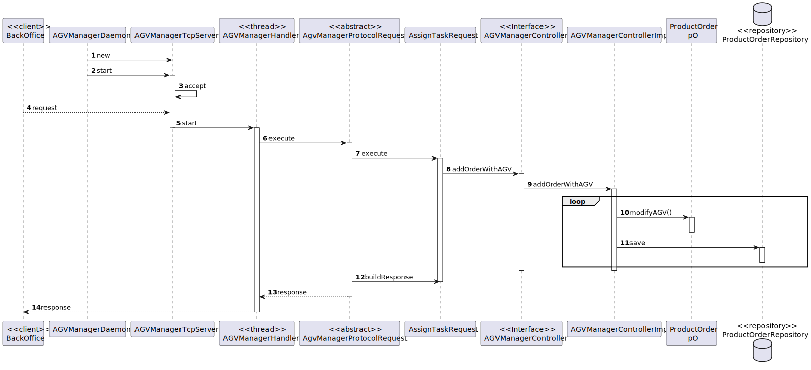

US4002
=======================================

# 1. Requisitos

> **Question**: Will the FIFO algorithm be used to control the tasks/orders that are waiting for an available AGV? If I am interpreting something wrong please clarify for me.
>
> **Answer**: The general idea is that product orders reaching a certain state whose meaning is of "need to be prepared by an AGV" are added to a queue. Then, following the FIFO algorithm orders are removed from the queue and assigned to available AGVs capable of performing the task that such order implies.

# 2. Análise

##Atribuição de tarefa aos AGVs

Nesta funcionalidade, os AGVs serão, sempre que possível, associados a uma order por ordem de criação.

##Utilização do AGVManager

Para ter acesso aos AGVs, é necessário estabelecer ligação com o AGVManager, e este é que acede a toda a informação pretendida acerca dos AGVs.

# 3. Design

## 3.1. Realização da Funcionalidade

###Diagrama SD

## 3.2. Padrões Aplicados

- Controller
- Service
- Repository
- Factory