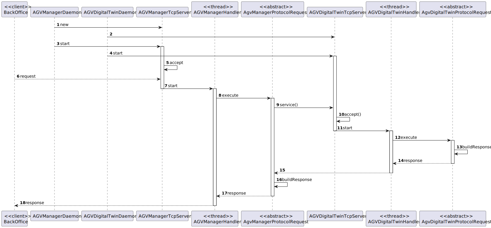

US4003
=======================================

# 1. Requisitos

> **Question**: What type of communication do you want, i.e., what are the communications that you want to have between these two. Like AGV Manager says "Take a product" and AGV Digital Twin says "Taken"? Is it something like that? Or am i confused?
>
> **Answer**: 
>The communication must follow the SPOMS2022 protocol. 
>
> **Question**: Regarding the USs 1901,4001, 5001, and 5002, what would you consider its complete state, that is, what would be the criterion to define whether or not this US is functional?
>
> **Answer**: 
>For all of those US, the communication between the two involved components must be implemented in accordance with the SPOMS2022. The requests processing can be somehow mocked. For instance, if processing a request implies saving some data to the database, the component can instead write such data to a log (mocking). Latter, on next sprint, the teams implement the interaction to the database.
>However, it is not advisable mocking everything, namely the components (internal) state. Notice that by mocking you are letting extra effort to the next sprint.   
>Finally, all US must be demonstrable.

# 2. Análise

> Primeiramente criamos os certificados a ser usados pela parte do servidor e pela parte do cliente, importando um para o outro e vice versa, de maneira a serem adicionados a 
"trust store" um do outro. A "trust store" é uma "pasta" de certificados que são confiaveis. 
Apos a criaçao, fizemos a alteraçao do tipo de "sockets" para "sockets SSL" e invocamos os metodos necessarios para fazer a verificaçao das "trust stores" e das "passwords".
Para haver a comunicacao para o "server" é preciso da parte do "server", estar constantemente ha espera de conexoes de "sockets" com o mesmo "ip" e com o mesmo "port", e para cada 
uma dessas conexoes de "sockets" fazer a verificacao de qual codigo é enviado de maneira a saber qual das funcionalidades foi pedida ao "server" para fazer, implementando assim
o protocolo de comunicacao "SPOMS" pedido. Já da parte do cliente é necessario criar um "socket" com o "ip" e "port" necessario e enviar o codigo para a funcionalidade pedida.
Para fazer a parte do cliente criamos um servico para tratar do pedido, primeiramente testando a comunicacao com o "server" e no fim fechando o conexao com o mesmo.

# 3. Design

## 3.1. Realização da Funcionalidade

### Diagrama SD

## 3.2. Padrões Aplicados
- Controller
- Service
- Repository
- Factory