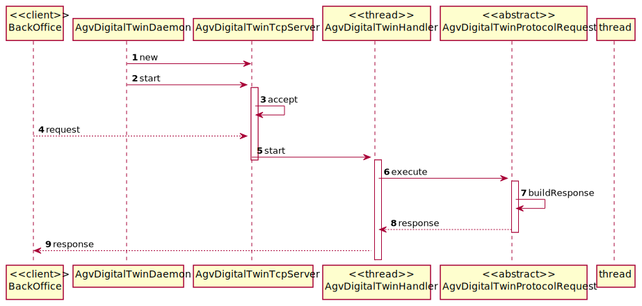
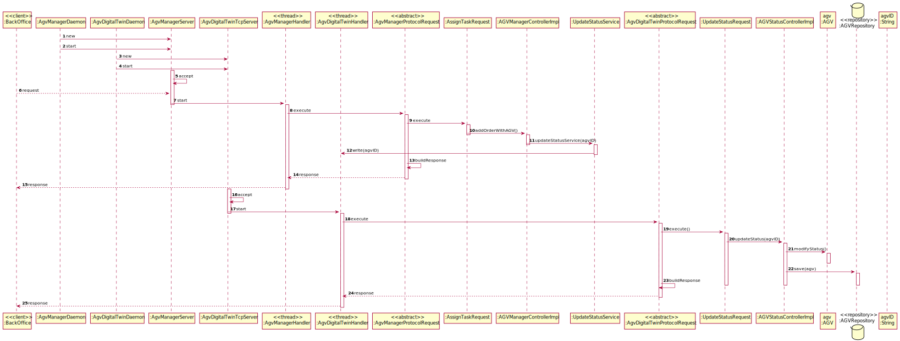

US5001
=======================================

# 1. Requisitos

> **Question**: What type of communication do you want, i.e., what are the communications that you want to have between these two. Like AGV Manager says "Take a product" and AGV Digital Twin says "Taken"? Is it something like that? Or am i confused?
>
> **Answer**: 
>The communication must follow the SPOMS2022 protocol. 
>
> **Question**: Regarding the USs 1901,4001, 5001, and 5002, what would you consider its complete state, that is, what would be the criterion to define whether or not this US is functional?
>
> **Answer**: 
>For all of those US, the communication between the two involved components must be implemented in accordance with the SPOMS2022. The requests processing can be somehow mocked. For instance, if processing a request implies saving some data to the database, the component can instead write such data to a log (mocking). Latter, on next sprint, the teams implement the interaction to the database.
>However, it is not advisable mocking everything, namely the components (internal) state. Notice that by mocking you are letting extra effort to the next sprint.   
>Finally, all US must be demonstrable.

# 2. Análise

##Pesquisa

Nesta funcionalidade o Cliente pode listar todos os produtos de uma vez, ou pesquisar os produtos por dois campos, estes são a brand (Marca) e a descrição, que automaticamente pesquisa pelas três descrições que estão no produto (shortDescription, extendedDescription e technicalDescription).

##Tipo de pesquisa

Para pesquisar os produtos, com o objetivo de uma pesquisa mais eficiente, foi feita uma pesquisa por segmentos de palavra, assim ao fazer uma pesquisa de um produto com a brand "Herbalife", se o Sales Clerk apenas pesquisar "Herba", vão ser listados os produtos Herbalife.

##Adicionar ao carrinho

Após pesquisar produtos, o sistema vai perguntar se o cliente quer adicionar produtos ao seu carrinho, se o cliente quiser adicionar ele vai escolher o produto que deseja adicionar por referência, e também vai inserir a quantidade de produtos que deseja comprar.

##Ver o carrinho

Ao ver o carrinho, o cliente consegue ver os produtos que estão no carrinho e também a sua quantidade.

# 3. Design

## 3.1. Realização da Funcionalidade

###Diagrama SD

###Diagrama SD detalhado

## 3.2. Padrões Aplicados

- Controller
- Service
- Repository
- Factory