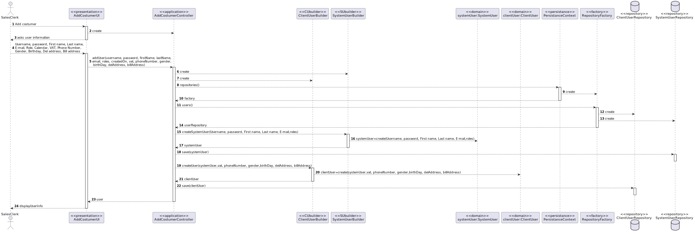

US1003
=======================================

# 1. Requisitos

Como um Sales Clerk:
* Eu quero registar um cliente

A interpretação feita deste requisito foi no sentido de criar um objeto AGV, e indicar, para além das suas características, o AGV dock (localizado na warehouse) a que está associado, sendo que este não deve estar associado a outro AGV.
Esta funcionalidade tem dependência da US 2001 (Criar uma warehouse).

# 2. Análise

Na user story 1003, depois de o sales clerk fazer login no sistema e selecionar a opção de registar o customer, este vai ter de inserir os dados do customer, desde o username, até ao número de telefone, para além disto tem também a opção de inserir campus não obrigatórios, tais como a data de nascimento ou as moradas. Após a inserção os dados são enviados para o controller onde temos dois repositórios, o de systemuser e o de clientuser, onde primeiramente vamos dar “save” ao system user( campus como username, email, etc) e posteriormente o client user(campos como o vat, phone numeber, etc) . Para garantir que ambos são inseridos se acontecer algum erro, criamos uma transação antes do primeiro save, e damos comit no fim do segundo. Antes de fazer o save os dados são enviados para um builder, onde criam o objeto que eventualmente vai levar “save”.

# 3. Design

## 3.1. Realização da Funcionalidade

###Diagrama SSD

###Diagrama SD

## 3.2. Diagrama de Classes

## 3.3. Padrões Aplicados

- Controller
- Builder
- Repository
- Factory

# 4. Implementação

Na user story 1003, depois de o sales clerk fazer login no sistema e selecionar a opção de registar o customer, este vai ter de inserir os dados do customer, desde o username, até ao número de telefone, para além disto tem também a opção de inserir campus não obrigatórios, tais como a data de nascimento ou as moradas. Após a inserção os dados são enviados para o controller onde temos dois repositórios, o de systemuser e o de clientuser, onde primeiramente vamos dar “save” ao system user( campus como username, email, etc) e posteriormente o client user(campos como o vat, phone numeber, etc) . Para garantir que ambos são inseridos se acontecer algum erro, criamos uma transação antes do primeiro save, e damos comit no fim do segundo. Antes de fazer o save os dados são enviados para um builder, onde criam o objeto que eventualmente vai levar “save”.

