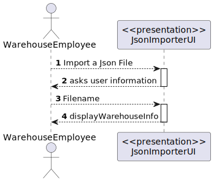
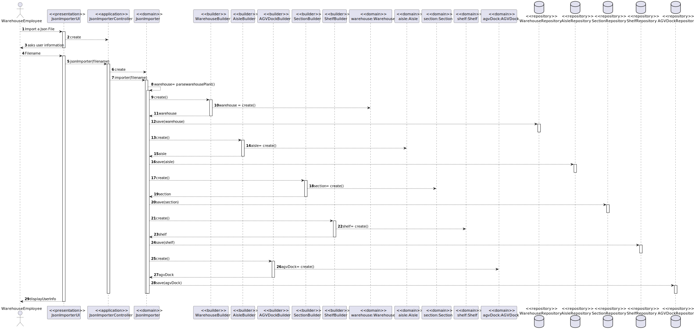
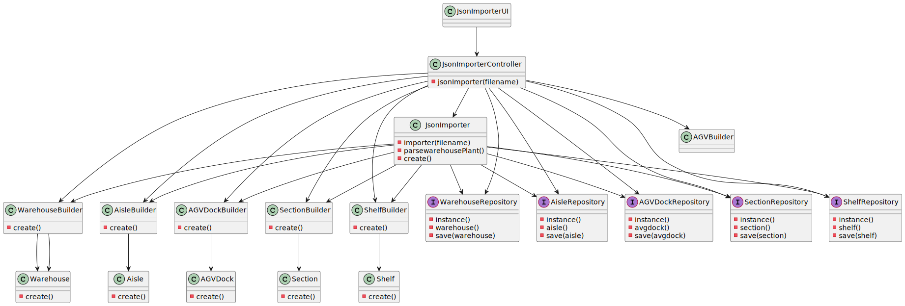

US2001
=======================================

# 1. Requisitos

*Nesta secção a equipa deve indicar a funcionalidade desenvolvida bem como descrever a sua interpretação sobre a mesma e sua correlação e/ou dependência de/com outros requisitos.*

*Exemplo*

**Demo1** Como {Ator} pretendo...

- Demo1.1. Blá Blá Blá ...

- Demo1.2. Blá Blá Blá ...

A interpretação feita deste requisito foi no sentido de ...

# 2. Análise

*Neste secção a equipa deve relatar o estudo/análise/comparação que fez com o intuito de tomar as melhores opções de design para a funcionalidade bem como aplicar diagramas/artefactos de análise adequados.*

*Recomenda-se que organize este conteúdo por subsecções.*

# 3. Design

## 3.1. Realização da Funcionalidade

###Diagrama SSD

###Diagrama SD

## 3.2. Diagrama de Classes

## 3.3. Padrões Aplicados

- Controller
- Builder
- Repository
- Factory

