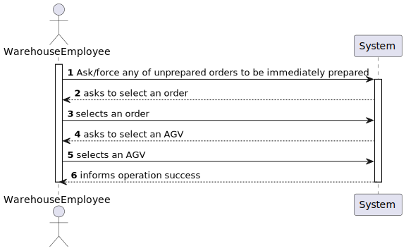
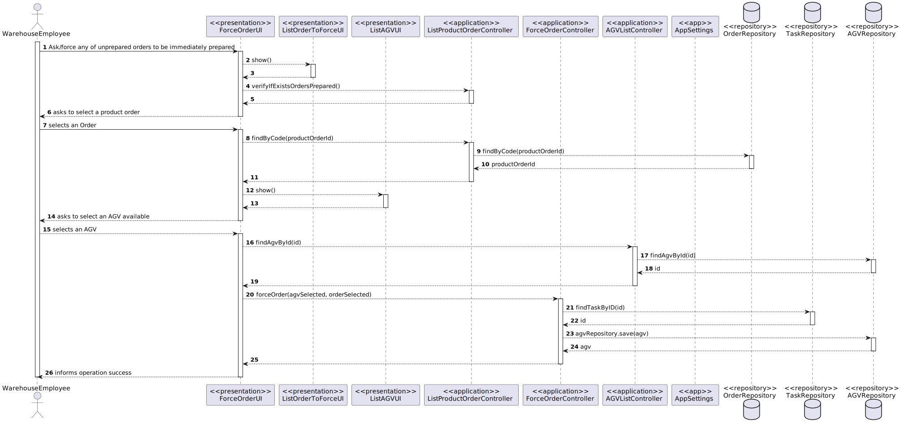
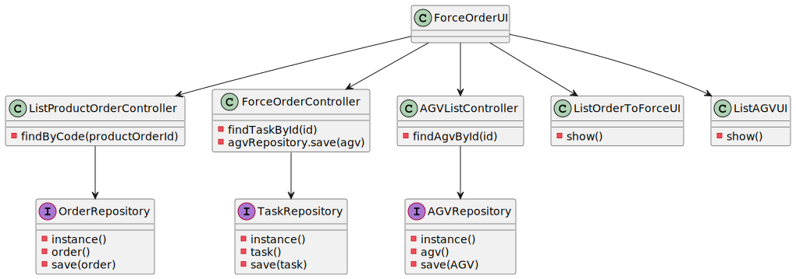

US2003
=======================================

# 1. Requisitos

Como um Cliente:
* Eu quero ver/pesquisar o catálogo de produtos e adicionar produtos ao meu carrinho

A interpretação feita deste requisito foi no sentido de o utilizador poder ver todos os produtos do catálogo, ou pesquisar algum produto por brand (Marca) e qualquer uma das três descrições (shortDescription, extendedDescription e technicalDescription), de modo a encontrar o produto que deseja comprar ao seu carrinho de compras, e logo adicioná-lo.
O cliente também pode ver os produtos e a sua quantidade no carrinho. Esta funcionalidade tem dependência nas seguintes US's -> US1001, US1002, US1005, US2001.

# 2. Análise

##Pesquisa

Nesta funcionalidade o Cliente pode listar todos os produtos de uma vez, ou pesquisar os produtos por dois campos, estes são a brand (Marca) e a descrição, que automaticamente pesquisa pelas três descrições que estão no produto (shortDescription, extendedDescription e technicalDescription).

##Tipo de pesquisa

Para pesquisar os produtos, com o objetivo de uma pesquisa mais eficiente, foi feita uma pesquisa por segmentos de palavra, assim ao fazer uma pesquisa de um produto com a brand "Herbalife", se o Sales Clerk apenas pesquisar "Herba", vão ser listados os produtos Herbalife.

##Adicionar ao carrinho

Após pesquisar produtos, o sistema vai perguntar se o cliente quer adicionar produtos ao seu carrinho, se o cliente quiser adicionar ele vai escolher o produto que deseja adicionar por referência, e também vai inserir a quantidade de produtos que deseja comprar.

##Ver o carrinho

Ao ver o carrinho, o cliente consegue ver os produtos que estão no carrinho e também a sua quantidade.

# 3. Design

## 3.1. Realização da Funcionalidade

###Diagrama SSD

###Diagrama SD

## 3.2. Diagrama de Classes

## 3.3. Padrões Aplicados

- Controller
- Service
- Repository
- Factory