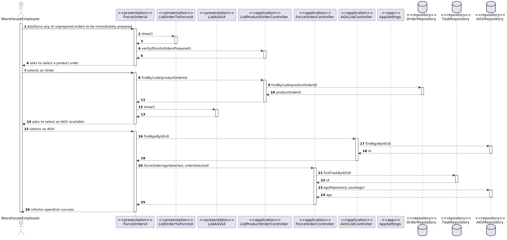

US2003
=======================================

# 1. Requisitos

> **Question**: Regarding US2003, the development team was wondering if the warehouse employee chooses the intended AGV available to prepare the specific order or if it should be assigned to any AGV available without even asking the warehouse employee.
> 
> **Answer**: 
> In the scope of US 2003, the AGV is selected by the warehouse employee from the ones that are available and are able to perform the task.
>
> **Question**: In US4002 it is required that the AGV Manager should support automatic assignment of orders to AGVs. In US2003 the Warehouse Employee will be able to assign any order to an AGV available. If the orders are being automatically assigned to an AGV (US4002) how can the Warehouse Employee assign a specific order to an AGV?
>
> **Answer**: Usually, and by default, one intends that system automatically assigns orders to AGVs (US 4002).
>However, if such option is not available (e.g.: turned off) or by some reason an order needs to be prepared faster than it would normally be, the warehouse employee has the ability to assign tasks manually (US 2003).

# 2. Análise

## Utilização da US

Quanto à US2003, interpretamos que esta seria usada apenas quando o AGVManager está desligado, uma vez que a US4002 fica responsável por atribuir, de forma automática, um AGV a uma order.

# 3. Design

## 3.1. Realização da Funcionalidade

###Diagrama SSD

###Diagrama SD

## 3.2. Diagrama de Classes

## 3.3. Padrões Aplicados

- Controller
- Service
- Repository
- Factory