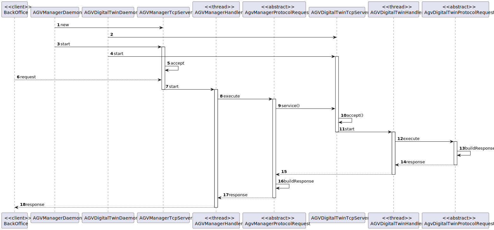

US4001
=======================================

# 1. Requisitos

> **Question**: Regarding the USs 1901,4001, 5001, and 5002, what would you consider its complete state, that is, what would be the criterion to define whether or not this US is functional?
>
> **Answer**: 
>For all of those US, the communication between the two involved components must be implemented in accordance with the SPOMS2022. The requests processing can be somehow mocked. For instance, if processing a request implies saving some data to the database, the component can instead write such data to a log (mocking). Latter, on next sprint, the teams implement the interaction to the database.
>However, it is not advisable mocking everything, namely the components (internal) state. Notice that by mocking you are letting extra effort to the next sprint.
>Finally, all US must be demonstrable.

# 2. Análise

##Serviço de cliente

Desenvolvemos, nesta funcionalidade, um serviço , pois as operações que utilizamos não pertenciam a nenhum objeto de domínio.

##Comunicação entre o cliente (BackOfficeApp e AGVDigitalTwin) e o server (AGVManager)

Desenvolvemos a comunicação usando o protocolo TCP, em que o cliente envia os pedidos através um socket cujo server interpreta-os e fornece o serviço correspondente. 

##Uso de threads

Para permitir vários clientes em simultâneo usar os serviços do AGVManager, implementamos threads, em que uma é responsável por aceitar conexões dos clientes, e todas as outras atender aos pedidos de cada um.

# 3. Design

## 3.1. Realização da Funcionalidade

###Diagrama SD

## 3.2. Padrões Aplicados

- Controller
- Service
- Repository
- Factory