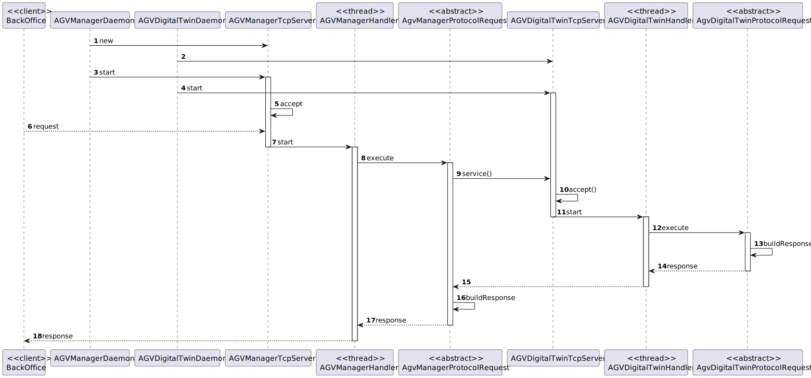

US4003
=======================================

# 1. Requisitos

> Não há evidência de questões respondidas pelo cliente sobre esta funcionalidade.

# 2. Análise

> Primeiramente criamos os certificados a ser usados pela parte do servidor e pela parte do cliente, importando um para o outro e vice versa, de maneira a serem adicionados a 
"trust store" um do outro. A "trust store" é uma "pasta" de certificados que são confiaveis. 
Apos a criaçao, fizemos a alteraçao do tipo de "sockets" para "sockets SSL" e invocamos os metodos necessarios para fazer a verificaçao das "trust stores" e das "passwords".
Para haver a comunicacao para o "server" é preciso da parte do "server", estar constantemente ha espera de conexoes de "sockets" com o mesmo "ip" e com o mesmo "port", e para cada 
uma dessas conexoes de "sockets" fazer a verificacao de qual codigo é enviado de maneira a saber qual das funcionalidades foi pedida ao "server" para fazer, implementando assim
o protocolo de comunicacao "SPOMS" pedido. Já da parte do cliente é necessario criar um "socket" com o "ip" e "port" necessario e enviar o codigo para a funcionalidade pedida.
Para fazer a parte do cliente criamos um servico para tratar do pedido, primeiramente testando a comunicacao com o "server" e no fim fechando o conexao com o mesmo.

# 3. Design

## 3.1. Realização da Funcionalidade

### Diagrama SD

## 3.2. Padrões Aplicados
- Controller
- Service
- Repository
- Factory