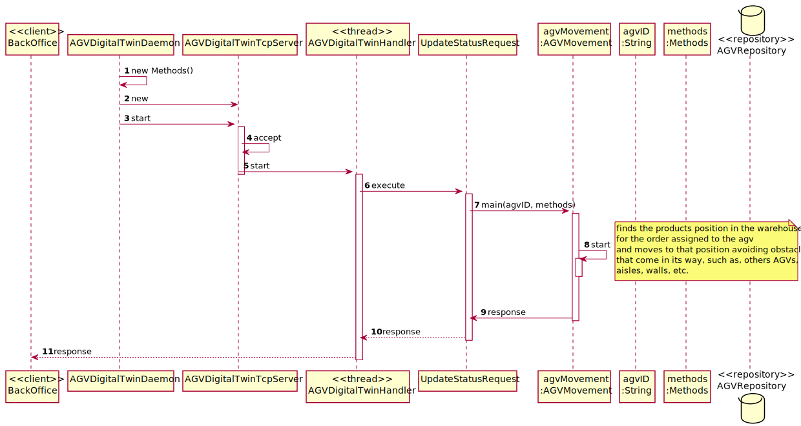

US5100
=======================================

# 1. Requisitos

> **Question**: Referring to the documentation, it is mentioned that the Route Planner module of the AGV Digital twin is responsible for "... (re)computing routes based on a source and target location on thewarehouse considering the warehouse plant only. It is worth notifying that AGV can only movehorizontally or vertically".
>
> What do you mean by source and target location of agv ? We can set agvdock as a starting point but what would be the end point?
>
> **Answer**: When assigning a task to an AGV, the AGV knows which products to collect, right?
>
> So, the source location (starting point) is the position where the AGV is at that moment (as you said, it might be the AGV dock)
>
> The target location (end point) might be the location of a product.
>
> However,  there are other possibilities.
> For instance, consider the scenario where the AGV has to collect 2 products (say A and B).
>
>At least three routes have to be computed:
>
>> **1.** From AGV Dock location to the location of product A.
>
>> **2.** From location of product A to the location of product B.
>
>> **3.** From location of product B to the AGV dock location.

> **Question**: 
>
>>**1.** Could you specify how the speed of an AGV is determined, seeing that we do not know the maximum speed of the AGV? 
>
>>**2.** At what charge do you suppose the AGV should move to the AGV docker to charge?
>
>>**3.** How should we measure the charging of an AGV should it have a certain percentage per minute or per hour?
>
>>**4.** Could you specify at what percentage the discharging of the AGV happens and if it is affected by other factors other than being turned on?
>
>>**5.** It is mentioned that when the AGV detects an obstacle 2 squares away it should reduce its velocity, could you please quantify the reduction.
>
> **Answer**: 
>You have to notice that the overall idea is to simulate a real AGV. As so, you might start by applying basic algorithms for every AGV functions (e.g.: moving, charging/discharging battery). Probably, you might need some input information to apply such algorithms (e.g.: min, max and average speed). Such information might vary from one AGV to another, for instance, based on the AGV model.  
>
>>**1.** If you need such information, you should collect such information previously (e.g.: US 2002).
>
>>**2.** Again, such value might be configurable by AGV (model).
>
>>**3.** You should adopt "seconds" as time unit.
>
>>**4.** As stated on the specifications' document: "when the AGV is moving battery consumption might be computed based on the travelled distance, but when the AGV is waiting/stopped on its dock battery consumption might be computed based on time.". Other factors might be considered, but at this stage, I recommend you to not apply a complex algorithm.
>
>>**5.** It is up to you decide that. However, notice that the idea is to avoid collision.

# 2. Análise

> Primeiramente, para a realizacao da US5100, decidimos começar por fazer a movimentaçao de um AGV num projeto a parte para conseguirmos perceber mais sobre memoria partilhada
de uma maneira que nao corressemos risco de estragar o projeto de alguma forma. Primeiramente começamos por apenas ter um agv e, numa matriz criada previamente, fazer com que 
ele chegasse ao destino, nao se preocupando com os obstaculos. Posteriormente, fizemos com que ele para ir para o destino tivesse que ter em consideraçao os obstaculos. Por fim,
implementamos memória partilhada com a utilizaçao de varios agvs(varias threads), logo os agvs tinham de ter em consideraçao as posicoes dos mesmos. Apos este algoritmo estar
completamente implementado no projeto auxiliar, decidimos passar para o verdadeiro projeto, onde começamos por construir a matriz dinamicamente retirando os valores da base de
dados. Apos isso fomos colocar na matriz os agvs que ja se encontravam criados na base de dados. Para terminar, criamos um ciclo de modo a que o agv atribuido a uma "order" 
conseguisse fazer o percurso ate aos varios produtos da mesma "order" e no fim voltar para a posicao inicial, lembrando que cada vez que chega a localizacao de um produto,
existe uma pausa de 2 segundos para simular a recolha do mesmo.
Para a verificaçao de obstaculos usamos sensores para verificar a frente, a traseira e as laterais, onde se consegue fazer uma verificao de ate 3 "squares" de distancia, onde
quando detetado a velocidade do mesmo é reduzida ou o agv para por completo. Para a velocidade usamos como velocidade padrao 1 segundo por "square", quando deteta um agv a 3 "squares" 2 segundos por "square",
quando aparece um agv a dois "squares" dele, fica parado por 3 segundos no mesmo "square" e quando aparece um no proximo "square" o agv para por completo ate haver um movimentaçao de outro. 
Para a bateria definimos como valor de perda de bateria, 1 por "square" de modo a haver uma facil demonstracao do modo poupanca tambem criado. O modo poupanca é ativado
quando a bateria do agv chega a 20, reduzindo entao o consumo de bateria para 0.2 por casa, mas reduzindo a velocidade do mesmo para 3 segundos por "square". Quando este entre no
modo poupanca de bateria ele vai apanhar o proximo produto e entao voltar imediatamente para a "Dock" onde, como chegou a dock no modo poupanca, ira começar a carregar. Quando
esta situaçao em que o agv para uma "order" a meio, outro agv fará o resto da sua order. Quando um agv acaba de carregar por completo, automaticamente faz a verificaçao se 
ha alguma order por fazer.
Apos tudo estar pronto numa matriz a correr na consola, decidimos colocar tudo a acontecer online, no "Dashboard", onde o "Warehouse Employee" pode acompanhar o movimento 
dos agvs a todo o momento, atualizando a posicao atual dos agvs de segundo a segundo. Para a colocação online, o Server do dashboard vai mandar um pedido para o digital twin
para aceder a posicao de cada agv, visitando a memoria partilhada, depois de saber as posicoes, converte para html e é colocado online.
Como havia um estado do agv que nao estava a ser utilizado ainda no projeto, decidimos entao definir uma percentagem(40% para motivos de apresentacao) de o agv ao começar a fazer a order "ficar estragado" e 
ser preciso a manutencao do mesmo. Para o fim da manutencao do agv criamos uma opcao no menu do "warehouse employee" para poder informar ao sistema que o agv "ja foi arranjado" e o mesmo automaticamente
inicia a procura por novas "orders" para fazer.

# 3. Design

## 3.1. Realização da Funcionalidade

### Diagrama SD

## 3.2. Padrões Aplicados
- Controller
- Service
- Repository
- Factory