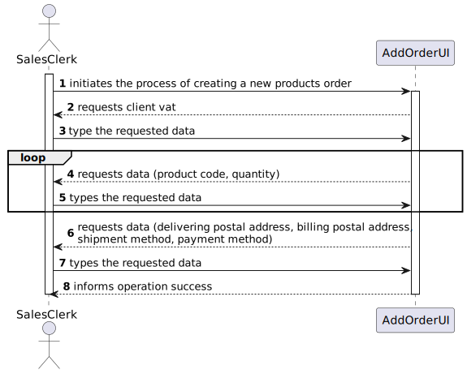
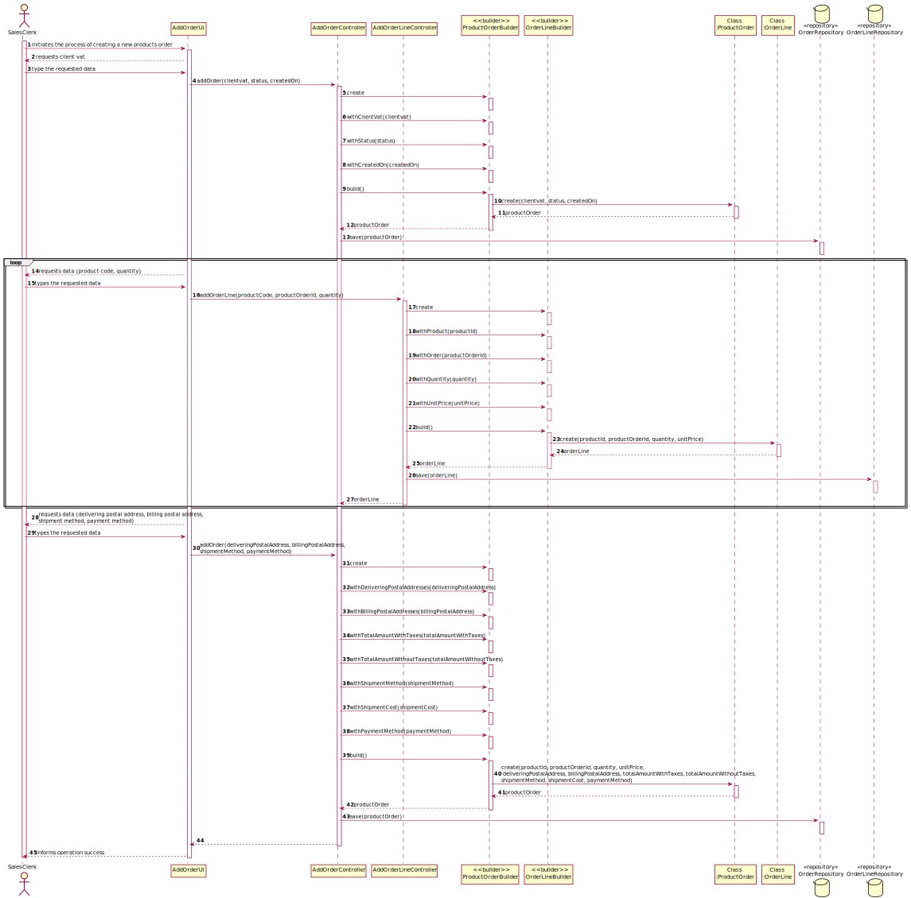
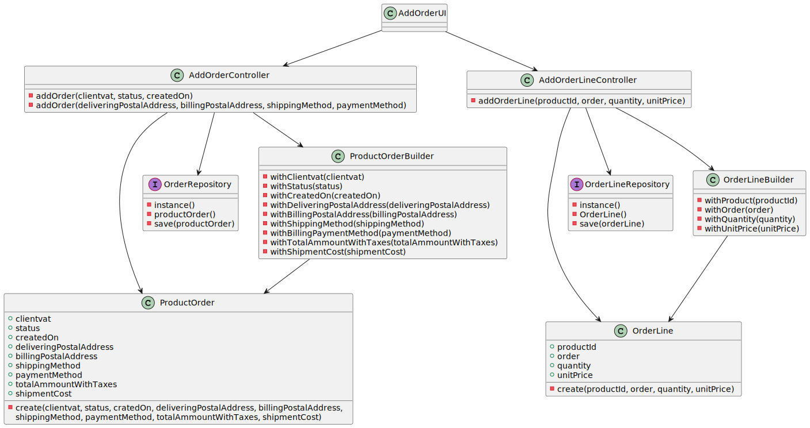

US1004
=======================================

# 1. Requisitos

Como um Sales Clerk:
* Eu quero criar um pedido de produtos dado um cliente

A interpretação feita deste requisito foi no sentido de criar um objeto ProductOrder (constituído por orderLines), e indicar, para além dos seus atributos, a que cliente está associado. Poderá também escolher se quer usar um dos endereços de entrega e cobrança do cliente ou então introduzir novos endereços. 
Esta funcionalidade tem dependência da US 1001 (Criar um produto), da US 1003 (Criar um cliente) e da US 1002 (Apresentar o catálogo de produtos), uma vez que existe a opção de visualizar o catálogo antes de inserir os produtos.

# 2. Análise

##Criação de OrderLines

A solução adotada nesta US passa pela criação de linhas do pedido, em que cada linha remte para um produto e a quantidade pedida do mesmo. O pedido de produtos em si é o conjunto de todas as orderLines associadas a ele.

##Taxas aplicadas aos produtos

Dado que existe pouca informação relativamente às taxas aplicadas ao produto, consideramos (não só nesta US) que o país de utilização da aplicação é Portugal e, então, aplicamos o IVA aos produtos selecionados.

##Atribuição de Status

No final da criação do ProductOrder, associamos o status de "Registered" de início.

# 3. Design

## 3.1. Realização da Funcionalidade

###Diagrama SSD

###Diagrama SD

## 3.2. Diagrama de Classes

## 3.3. Padrões Aplicados

- Controller
- Builder
- Repository
- Factory
