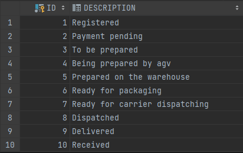
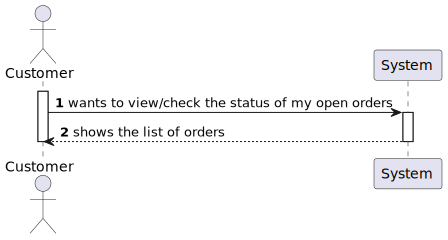
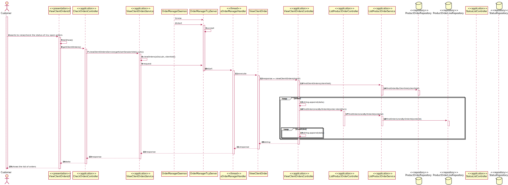
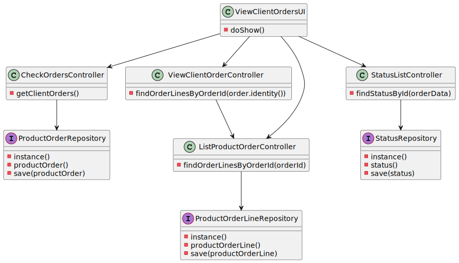

US1502
=======================================

# 1. Requisitos

Como um Costumer (Cliente):
* Eu quero ver o estado das minhas encomendas (orders) em aberto.

> **Question**:
> In the US 1502, it is asked to "view/check the status of my open orders", can you clarify if the open orders are all the orders that have been created or if it is orders with a specific status.
> 
> **Answer**:
> It is all orders that have not been delivered to the customer yet.

# 2. Análise

##Lista de Orders

Nesta funcionalidade o Cliente consegue ver todas as suas orders e o estado delas. Apesar de existirem 9 estados para uma order, foi considerada uma forma mais fácil e simplificada de mostrar ao "Customer" o estado da sua encomenda.

##Status da encomenda

Foram nomeados 9 estados para justificar a situação de uma encomenda:

Devido a estes estados serem demasiado específicos e existirem muitos, foi decido simplificar os dados da tabela de modo a que o cliente tenha uma abordagem mais simples do estado da sua encomenda. Para isso, resumiu-se alguns estados em um único estado. Na interface do cliente, os estados da encomenda eram mostrados da seguinte forma:

1 (Registered) --> Current Status: Registered

2 (Payment pending) --> Current Status: Payment pending

3,4,5 (To be prepared, Being prepared by agv, Prepared on the warehouse) --> Current Status: Being prepared

6,7,8 (Ready for packaging, Ready for carrier dispatching, Dispatched) --> Current Status: Dispatched

9 (Delivered) --> Current Status: Delivered

10 (Received) --> Current Status: Received

# 3. Design

## 3.1. Realização da Funcionalidade

###Diagrama SSD

###Diagrama SD

## 3.2. Diagrama de Classes

## 3.3. Padrões Aplicados

- Controller
- Service
- Repository
- Factory