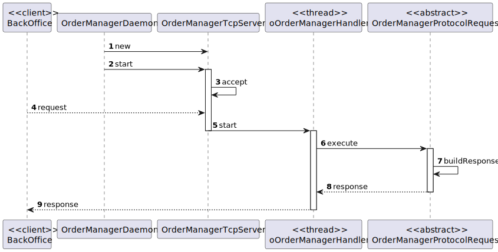

US1901
=======================================

# 1. Requisitos

> **Question**: Regarding the USs 1901,4001, 5001, and 5002, what would you consider its complete state, that is, what would be the criterion to define whether or not this US is functional?
> 
> **Answer**: For all of those US, the communication between the two involved components must be implemented in accordance with the SPOMS2022. The requests processing can be somehow mocked. For instance, if processing a request implies saving some data to the database, the component can instead write such data to a log (mocking). Latter, on next sprint, the teams implement the interaction to the database.  However, it is not advisable mocking everything, namely the components (internal) state. Notice that by mocking you are letting extra effort to the next sprint.  Finally, all US must be demonstrable.

# 2. Análise

##Utilização do OrdersServer

Esta funcionalidade corresponde ao desenvolvimento do OrdersServer, de modo a que seja a CostumerApp possa ser integrada e a US1901 possa utilizar o server.

# 3. Design

## 3.1. Realização da Funcionalidade

###Diagrama SD

## 3.2. Padrões Aplicados

- Controller