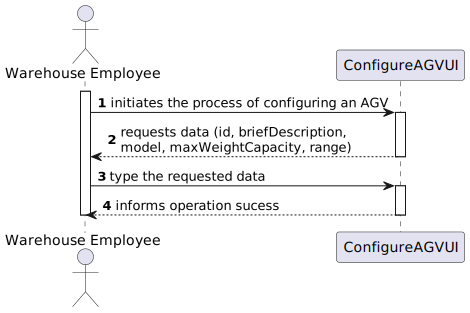
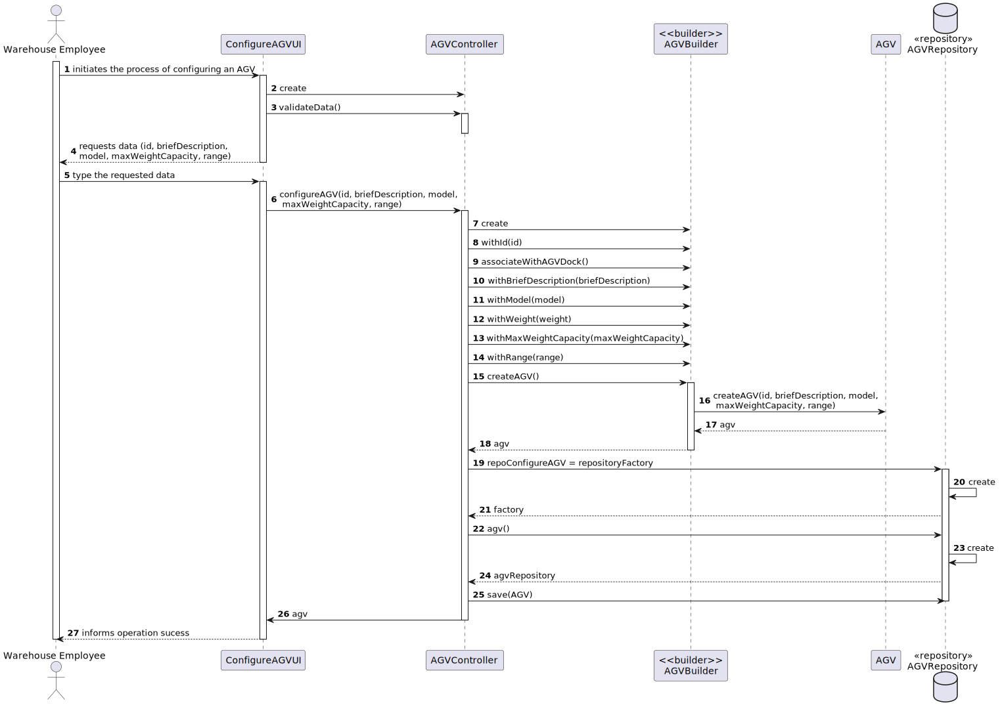
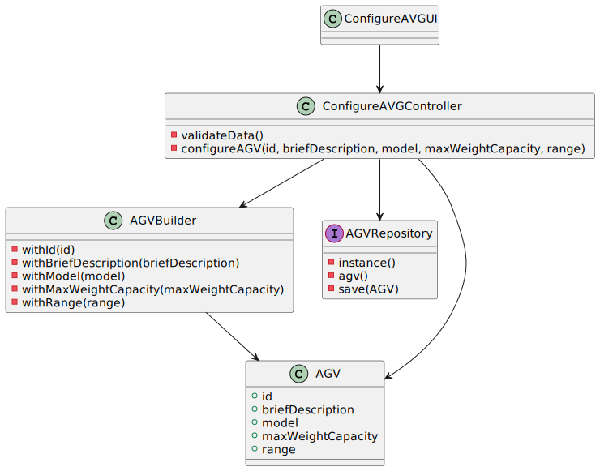

US2002
=======================================

# 1. Requisitos

As Warehouse Employee, I want to configure the AGVs available on the warehouse.
Como um Warehouse Employee:
* Eu quero configurar os AGV's livres na warehouse

A interpretação feita deste requisito foi no sentido de criar um objeto AGV, e indicar, para além das suas características, o AGV dock (localizado na warehouse) a que está associado, sendo que este não deve estar associado a outro AGV.
Esta funcionalidade tem dependência da US 2001 (Criar uma warehouse).

# 2. Análise

##Warehouse associada

Visto que o cliente, durante a realização do sprint, indicou que só haveria uma warehouse no sistema, a questão da seleção da warehouse foi descartada. Caso houvesse mais warehouses, o AGV iria ser associado à warehouse onde o Warehouse Employee trabalha.

##AGV docks livres

Aquando da introdução do AGV dock a que o AGV estará associado, é feita uma verificação relativamente à disponibilidade do AGv dock, de modo a manter a integridade na planicação da warehouse (1 AGV -> 1 AGV dock).

##Atribuição de task

No final da criação do AGV, associamos a task de "Free" de início visto que este não está a realizar nenhuma atividade no momento de criação do mesmo.

# 3. Design

## 3.1. Realização da Funcionalidade

###Diagrama SSD

###Diagrama SD

## 3.2. Diagrama de Classes

## 3.3. Padrões Aplicados

- Controller
- Builder
- Repository
- Factory

