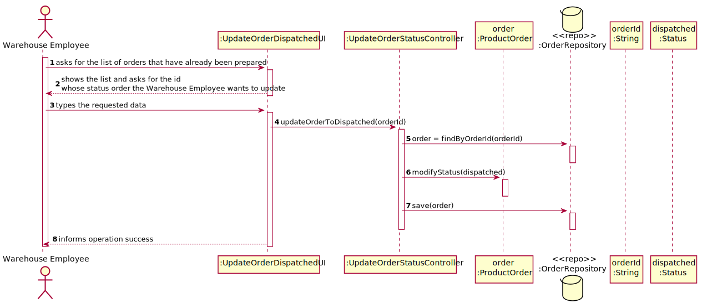

US2004
=======================================

# 1. Requisitos

> **Question**: Regarding this feature, what would you consider to be its complete state, that is, what would be the criterion to define whether or not this feature was functional?
>
> **Answer**: Being the US 2004 as follows
>
>"As Warehouse Employee, I want to access the list of orders that have already been prepared by the AGVs and be able to update any of those orders as having been dispatched for customer delivery. "
> 
>it seems the criteria you are looking for is somehow obvious: the status of the selected order(s) changed from "already been prepared by the AGV" to "dispatched for customer delivery".

# 2. Análise

##Escolha das orders

Para fazer a pesquisa de todas as orders que tenham sido preparadas por um AGV, verificamos o seu status. Caso tenha o status a 'Prepared on the warehouse' então é mostrado ao utilizador.

##Atualização do status

Após a apresentação de todas as orders que já tenham sido preparadas por um AGV, segue-se a mudança de estado da order selecionada para 'Dispatched'.
# 3. Design

## 3.1. Realização da Funcionalidade

###Diagrama SSD

###Diagrama SD

## 3.2. Padrões Aplicados

- Controller
- Service
- Repository
- Factory