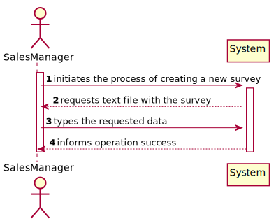
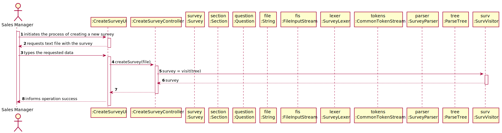
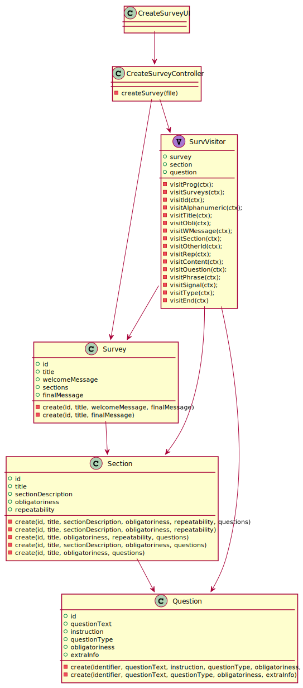

US3001
=======================================

# 1. Requisitos

> **Question**: When creating a questionnaire should the user give a file with the questionnaire or write each question and section trough the command line?
>
> **Answer**: First of all, and to be clear, notice that creating a surveys has two distinct set of data:
>
>* alphanumeric code, a description, the period (in days) it will be performed and a set of rules that allows the system to determine the survey target audience; and
>* the intended questionnaire, i.e. the title, the welcome message, sections and questions.

> **Question**: 
> * The same section can be present in more than one questionnaire?
> * The same question can be present in more than one section?
>
> **Answer**: Yes, that can happen.
>However, there is no intend to reutilize questions and/or sections. If that happens, the user will type the question/section again.

> **Question**: Can you specify / define what business rules are associated to Questionnaire, Section and Question? (Eg: Questionnaire ID only has 9 characters / follows an expression).
>
> **Answer**: Basic business rules related with Questionnaire, Section and Question are already available on the specifications document, namely on Table 1, 2 and 3.
> Teams must adopt common-sense when applying other criteria such as min/max chars length and support/explain the rationale taken.

# 2. Análise

##Inserção de questionário

Nesta funcionalidade, o grupo decidiu que a importação de um questionário seria através de um ficheiro de texto com a informação do questionário.

##Apresentação do questionário

Após o parse, consultando a gramática, do questionário, a sua informação é mostrada na consola.

##Persistência

Após recorrer ao professor das aulas Teóricas-Práticas, concluimos que, para este sprint, não é necessário persistir o questionário.
# 3. Design

## 3.1. Realização da Funcionalidade

###Diagrama SSD

###Diagrama SD

## 3.2. Diagrama de Classes

## 3.3. Padrões Aplicados

- Controller