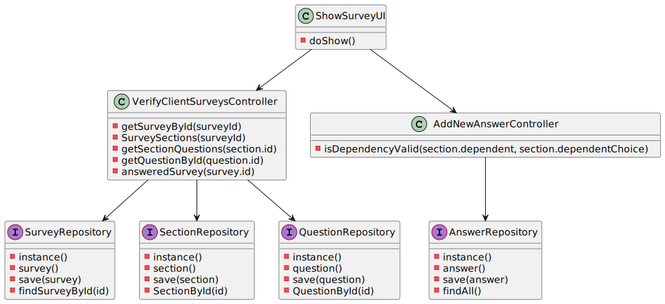

US3501
=======================================

# 1. Requisitos

Como um Cliente:
* Pretendo responder a qualquer um dos questionários que me foi atribuído

> **Question**: Question 1: In regard to the survey rules, can a survey have multiple of them? Question 2: If multiple rules were chosen for a given survey, would these be used in conjunction or disjunction? Example: "Having ordered a certain product and be of a certain gender" or "Having ordered a certain product or be of a certain gender"
>
> [**Answer:**](https://moodle.isep.ipp.pt/mod/forum/discuss.php?d=15739#p20233) 

> **Question**: When showing the questionnaire questions and asking for the awnsers to the costumer, should we use a graphical interface or the command line?
>
> [**Answer:**](https://moodle.isep.ipp.pt/mod/forum/discuss.php?d=16805) 

> **Question**: How should the surveys be distributed to the Customers? Should it be through the orders api?
>
> [**Answer:**](https://moodle.isep.ipp.pt/mod/forum/discuss.php?d=16983) 

# 2. Análise

Nesta US, o cliente pretende responder a qualquer um dos questionários que lhe sejam atribuídos. Sendo assim, aquando da criação de cada questionário (US 3001), é pedido ao sales manager o contexto em que o funcionário irá ser apresentado ao cliente. Os contextos criados que lhe são apresentados são:
	* Quando o cliente realiza uma encomenda;
	* Quando o cliente pertence a um determinado intervalo de idades;
	* Quando o cliente encomenda um determinado produto.

Sendo assim, cada questionário contém duas listas: lista de clientes por responder e lista de clientes que já responderam ao determinado questionário, sendo que a primeira refere apenas aos clientes que foram inquiridos para responder ao questionário.
Ou seja, sempre que um cliente cumpre com com um dos critérios definidos para os questionários, é adicionado à lista de clientes por responder em cada questionário (que contém o determinado critério) e, aparece no menu inicial, uma notificação com o número de questionários que o cliente tem por responder.

##Seleção do questionário

Após o cliente selecionar a opção de ver os questionários por responder, é lhe apresentado a lista dos questionários, contendo o ID e o título de cada um.
Para o cliente selecionar um deles, é necessário introduzir então o ID do questionário em questão. Após a validação do ID, é apresentado o determinado questionário ao cliente.

##Resposta ao questionário

É apresentado ao cliente, inicialemente, o ID, o título e a mensagem de boas-vindas ao cliente. Segue-se então, para cada uma das secções do questionário, a sua descrição e, para as questões da secção, a pergunta em si e é pedida então uma resposta por parte do cliente.
Em cada pergunta, caso a sua obrigatoriedade seja opcional, é referido logo após a questão, entre parentesis, que a questão não é obrigatória.

##Validação das respostas

Apesar de ser no momento da resposta que ocorre as primeiras validações à resposta do cliente (p.e. validar se a resposta introduzida é numérica caso a questão é do tipo 'numeric'), foi criada uma nova gramática para validar as respostas do cliente.
O uso da gramática é feito por parte do sales manager, em que no seu menu contém uma opção de validação de respostas, onde ele poderá então validar as respostas de cada utilizador referentes a cada questionário.

##Importação das respostas

Logo após o final do questionário, é gerado um ficheiro texto contendo todas as respostas do cliente e que serverá, mais tarde, para o sales manager fazer então a validação com a gramática criada.
O nome do ficheiro é :
	-> vatdocliente_idquestionário. (p.e. 111111111_ID1.txt)
Cada ficheiro é gravado na pasta 'Answers', localizada na pasta base do projeto.

# 3. Design

## 3.1. Realização da Funcionalidade

###Diagrama SSD

###Diagrama SD

## 3.2. Diagrama de Classes

## 3.3. Padrões Aplicados

- Controller
- Service
- Repository
- Factory
- DTO