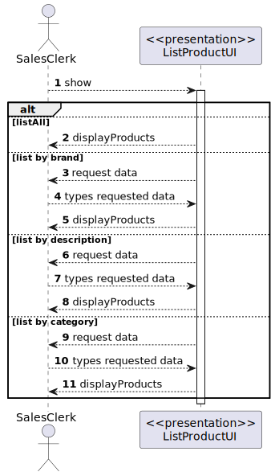
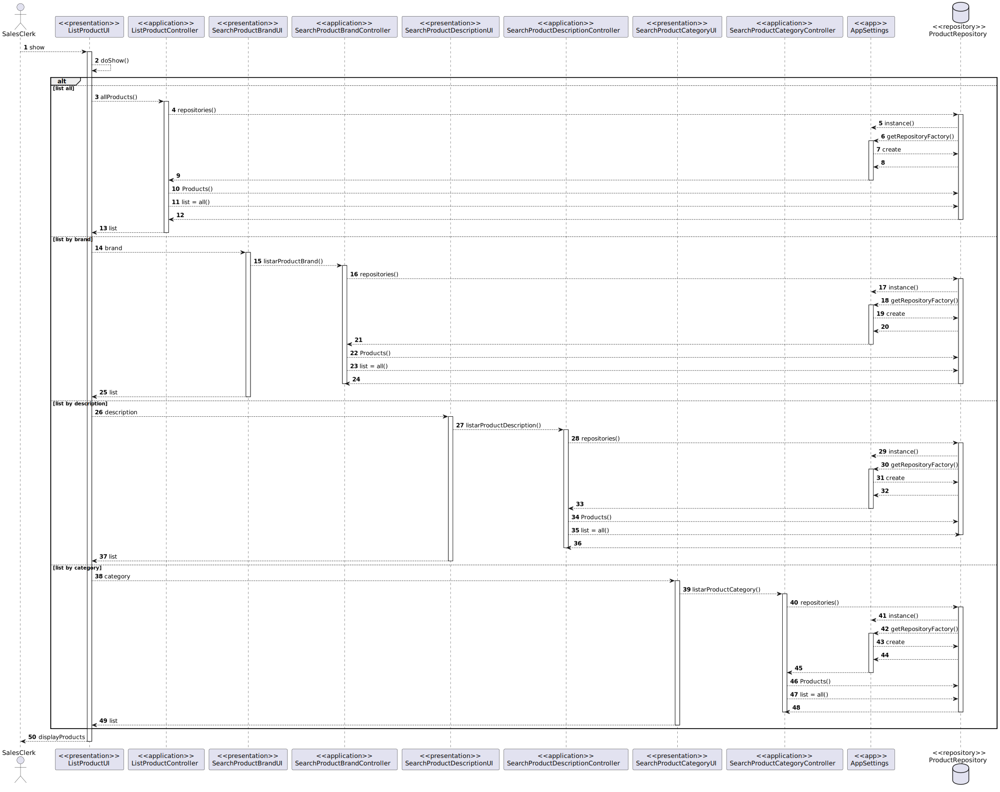
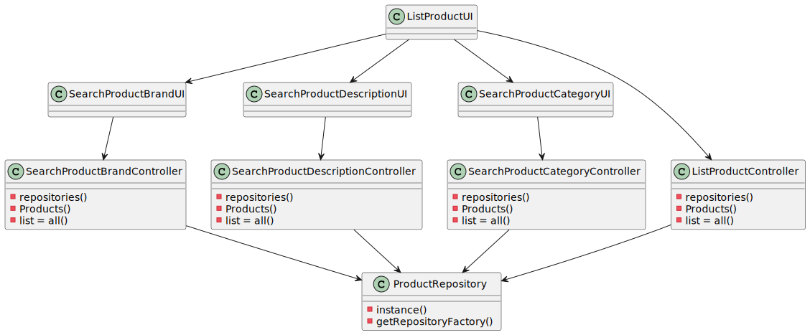

US1002
=======================================

# 1. Requisitos

Como um Sales Clerk:
* Eu quero ver/pesquisar o catálogo de produtos

A interpretação feita deste requisito foi no sentido de o utilizador poder ver todos os produtos do catálogo, ou pesquisar algum produto por brand (Marca), qualquer uma das três descrições (shortDescription, extendedDescription e technicalDescription) e também por categoria (categoryCode).
Esta funcionalidade tem dependência nas seguintes US's -> US1001, US1005, US2001.

# 2. Análise

##Pesquisa

Nesta funcionalidade o Sales Clerk pode listar todos os produtos de uma vez, ou pesquisar os produtos por três campos, estes são a brand (Marca), a descrição, que automaticamente pesquisa pelas três descrições que estão no produto (shortDescription, extendedDescription e technicalDescription), e também é possível pesquisar por categoria (categoryCode).

##Tipo de pesquisa

Para pesquisar os produtos, com o objetivo de uma pesquisa mais eficiente, foi feita uma pesquisa por segmentos de palavra, assim ao fazer uma pesquisa de um produto com a brand "Herbalife", se o Sales Clerk apenas pesquisar "Herba", vão ser listados os produtos Herbalife.

# 3. Design

## 3.1. Realização da Funcionalidade

###Diagrama SSD

###Diagrama SD

## 3.2. Diagrama de Classes

## 3.3. Padrões Aplicados

- Controller
- Service
- Repository
- Factory
