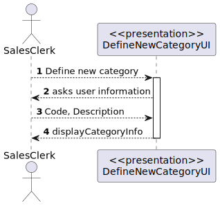
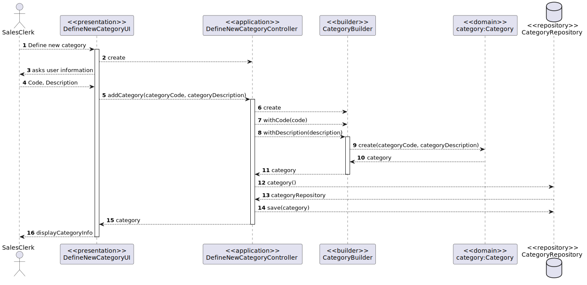

US1001
=======================================

# 1. Requisitos

Como um Sales Clerk:
* Eu quero especificar uma nova categoria de produtos

A interpretação feita deste requisito foi no sentido de criar um objeto Category.
Esta funcionalidade não tem dependências.

# 2. Análise

##Atributos

A categoria possuí dois atributos, a categoryCode (código de categoria), sendo este um atributo único, e a categoryDescription (descrição da categoria).

As categorias são necessárias criar para podermos especificar um produto para venda (US1001 depende desta funcionalidade).

# 3. Design

## 3.1. Realização da Funcionalidade

###Diagrama SSD

###Diagrama SD

## 3.2. Diagrama de Classes

## 3.3. Padrões Aplicados

*Nesta secção deve apresentar e explicar quais e como foram os padrões de design aplicados e as melhores práticas.*

# 4. Implementação

*Nesta secção a equipa deve providenciar, se necessário, algumas evidências de que a implementação está em conformidade com o design efetuado. Para além disso, deve mencionar/descrever a existência de outros ficheiros (e.g. de configuração) relevantes e destacar commits relevantes;*

*Recomenda-se que organize este conteúdo por subsecções.*