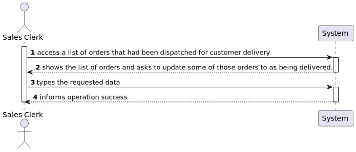
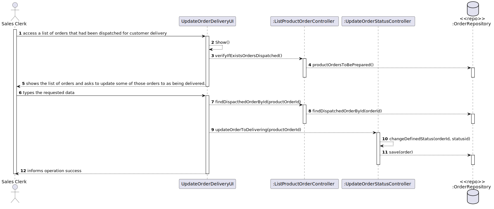
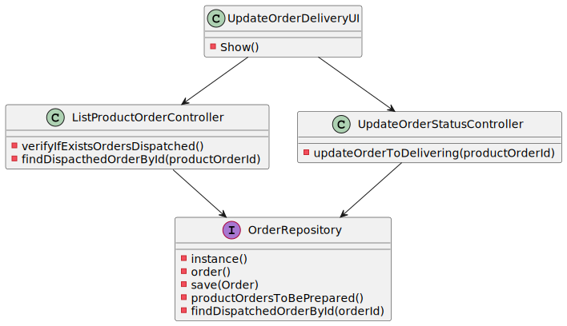

US1006
=======================================

# 1. Requisitos

Como um Sales Clerk:
* Eu quero ter acesso à lista de orders que foram despachadas para entrega ao cliente e ser capaz de atualizar as orders como entregues.

> **Question**:
>
> **Answer**: 
>

# 2. Análise

##Lista de Orders

Nesta funcionalidade o Sales Clerk consegue visualizar a lista de todas as orders enviadas já para entrega de cliente, de modo a ser mais fácil escolher as orders que se quer atualizar como entregues. Caso não exista nenhuma order neste estado, o sistema vai mostrar que não existe nenhuma order a ser "dispatched to customer delivery" de momento.

##Atualizar orders como entregues

Para escolher uma order para ser atualizada como "entregue", o Sales Clerk apenas precisa inserir o "id" de uma das orders da lista apresentada. Ao inserir o "id", a order vai alterar o seu estado e uma mensagem a dizer que a order foi atualizada com sucesso vai ser apresentada. Caso o id inserido esteja inválido, o sistema vai mostrar: "Invalid id. Product Order does not exist or it is not prepared yet!", e vai ser pedido ao funcionário que digite o "id" da order novamente.

# 3. Design

## 3.1. Realização da Funcionalidade

###Diagrama SSD

###Diagrama SD

## 3.2. Diagrama de Classes

## 3.3. Padrões Aplicados

- Controller
- Service
- Repository
- Factory