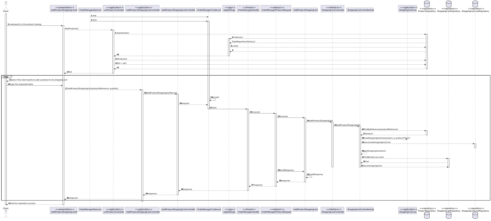

US1501
=======================================

# 1. Requisitos

Como um Cliente:
* Eu quero ver/pesquisar o catálogo de produtos e adicionar produtos ao meu carrinho

> **Question**: We wanted to know which attributes are needed on the shopping cart to show to the user (customer)?
>
> **Answer**: 
>In addition, you can always put yourself in the role of a customer (and not of a developer) and think a little about what information you, as a customer, would like to see. And that's it, that's the information you have to show.

# 2. Análise

##Pesquisa

Nesta funcionalidade o Cliente pode listar todos os produtos de uma vez, ou pesquisar os produtos por dois campos, estes são a brand (Marca) e a descrição, que automaticamente pesquisa pelas três descrições que estão no produto (shortDescription, extendedDescription e technicalDescription).

##Tipo de pesquisa

Para pesquisar os produtos, com o objetivo de uma pesquisa mais eficiente, foi feita uma pesquisa por segmentos de palavra, assim ao fazer uma pesquisa de um produto com a brand "Herbalife", se o Sales Clerk apenas pesquisar "Herba", vão ser listados os produtos Herbalife.

##Adicionar ao carrinho

Após pesquisar produtos, o sistema vai perguntar se o cliente quer adicionar produtos ao seu carrinho, se o cliente quiser adicionar ele vai escolher o produto que deseja adicionar por referência, e também vai inserir a quantidade de produtos que deseja comprar.

##Ver o carrinho

Ao ver o carrinho, o cliente consegue ver os produtos que estão no carrinho e também a sua quantidade.

# 3. Design

## 3.1. Realização da Funcionalidade

###Diagrama SSD

###Diagrama SD

## 3.2. Diagrama de Classes

## 3.3. Padrões Aplicados

- Controller
- Service
- Repository
- Factory